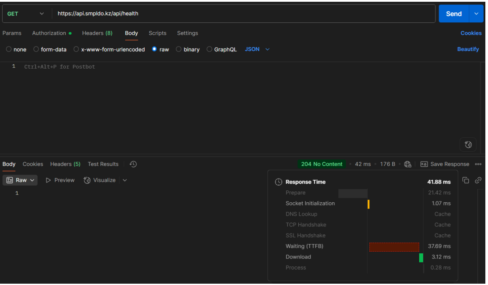

# SMPLDO — Тестовое задание

## Задание 1: Анализ функциональности веб- и мобильной версии

### Сравнение функционала

1. **Веб-версия:**
   - Нет сканера (сканирование QR-кодов или документов недоступно).
   - Нет чек-листа (отсутствует функционал чек-листов).
   - В задачах названия не совпадают: в веб — "Проверка", в мобильной — "Инспекция".
   - В разделе отзывов: в веб-версии — "жалобы", в мобильной — "отзывы".
   - В веб-версии отображаются проценты (38%, 13%, 5%), в мобильной — дробные значения (0,5 ≈ 37,5%, 12,5%, 5%).
   - В веб-версии есть шкала прогресса сверху, в мобильной — нет.

2. **Мобильная версия:**
   - Нельзя изменить статус (доступен/не доступен) объекта.
   - Нет шкалы прогресса сверху.
   - В мобильной версии нет чек-листа.

### Баги и несоответствия
- Различие в отображении процентов (целые vs дробные).
- Различие в терминологии ("жалобы" vs "отзывы", "Проверка" vs "Инспекция").

---

## Задание 2: API тестирование с помощью Postman

### 1. GET https://api.smpldo.kz/api/health
- **Статус-код:** 204 No Content
- **Время ответа:** 41.88 ms
- **Результат:** Успешно, соответствует требованиям (статус и время).



### 2. GET https://api.smpldo.kz/api/availableMessagingTypes
- **Статус-код:** 200 OK
- **Время ответа:** 94.26 ms
- **Ответ:**
  ```json
  [
    "email",
    "phone",
    "whatsapp"
  ]
  ```
- **Проверки:**
  - Ответ — массив, длина 3 (>2).
  - В массиве есть "email".
  - Время ответа < 1 секунды.
- **Результат:** Успешно, все условия выполнены.


---

_Скриншоты для API-тестов сохранены как `api_health.png` и `api_availableMessagingTypes.png`._